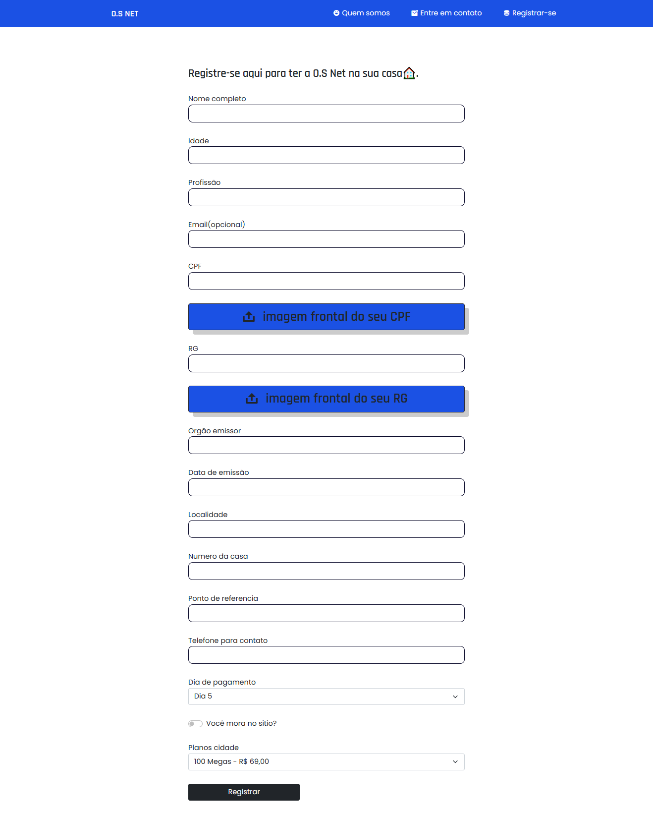
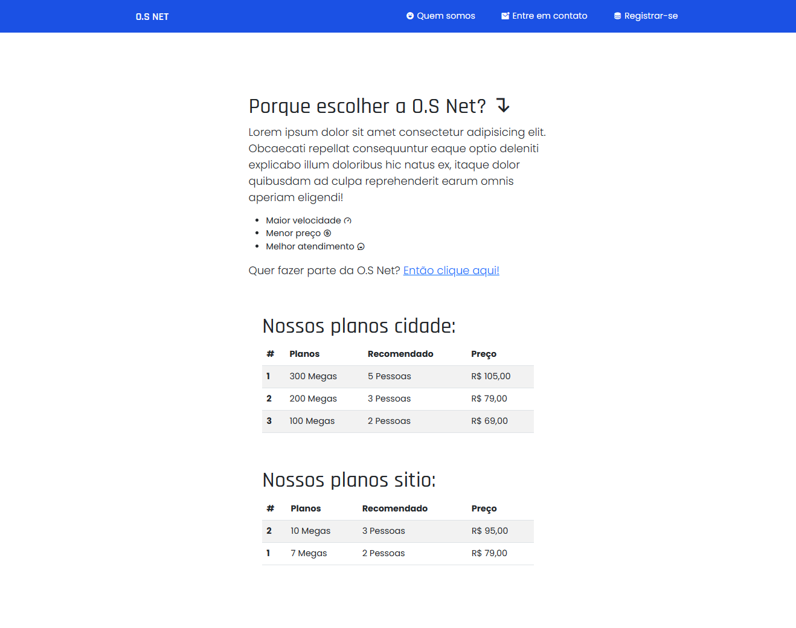

# 👨‍💻 Projeto O.S NET TELECOM 👩‍💻

### Descrição do projeto:

Website criado para agilizar o processo de coleta de dados para cadastros no sistema da empresa O.S NET Telecom

### Tecnologias usadas

 * HTML, CSS e JS
 * NodeJS (Multer, BodyParser)

### Requerimentos:
 * Node 
 * Multer
 * body-parser

### Sistemas de rotas:

`/` Rota padrão, tela de registro.  
`/osnet`  Informações sobre a empresa, planos etc...  
`/upload` Rota de envio de informações

### Imagens do projeto:

<h4>Tela de registro</h4>

<h4>Tela de sobre a empresa</h4>

## Redes sociais

    <a href="https://www.linkedin.com/in/kayque-othon/">Linkedin</a> |
    <a href="https://www.instagram.com/devothon">Instagram</a>

